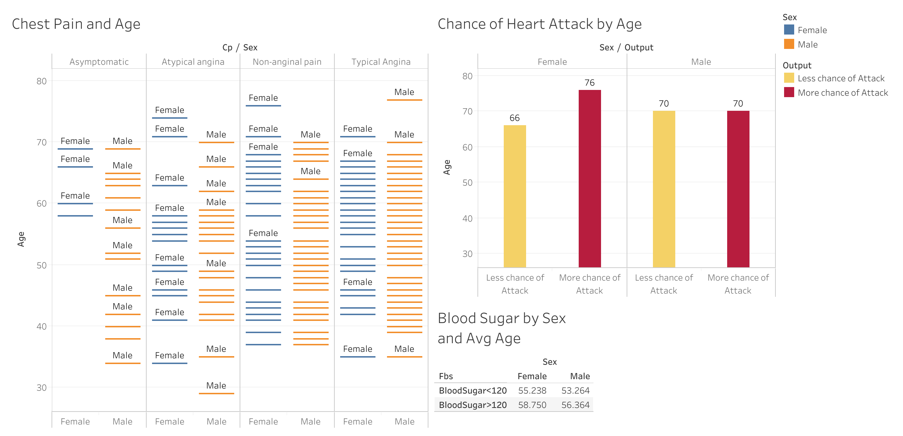
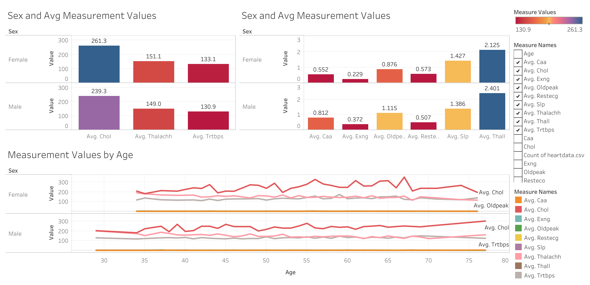

# Data Analysis and Visualization For HeartData

## Overview

This dataset provides insights into various factors associated with the likelihood of a heart attack. The analysis and visualizations below offer valuable insights.

## Insights

1. **Chest Pain and Age Relationship:**
    - *Analysis:*
        - Asymptomatic pain is more prevalent in younger males (starting at age 35) and in females around age 58.
        - Atypical angina is more common in men aged 40-60, with females aged 75 also showing this pattern.
        - Non-anginal pain patterns are similar in both genders, with signs appearing around age 38 and observed in older women above 75.
        - Typical angina is more common in men, especially in older age groups (around 80).

2. **Heart Attack Chances by Age:**
    - *Analysis:*
        - Chances of a heart attack for females are higher around age 76 and lower at age 66.
        - For males, similar chances are observed around age 70.

3. **Blood Sugar by Sex and Avg Age:**
    - *Analysis:*
        - The average age for females with blood sugar above 120 is 59 and below 120 is 56.
        - For males, blood sugar above 120 is observed at an average age of 56, and below 120 at an average age of 53.

## Visualization

# Second Dashboard: Sex and Avg Measurement Values

## Overview

This dashboard provides insights into the average measurement values based on gender and age. The analysis and visualizations below offer valuable insights.

## Analysis and Insights

1. **Sex and Avg Measurement Values:**
    - *Analysis:*
        - For females:
            - Average cholesterol: 261.3
            - Average thalachh: 151.1
            - Average trtbps: 133.1
        - For males:
            - Average cholesterol: 239.3
            - Average thalachh: 149
            - Average trtbps: 130.9
    - *Insights:*
        - Average values of cholesterol, thalachh, and trtbps are higher in females as compared to males as they grow old.

2. **Sex and Avg Measurement Values (Part 2):**
    - *Analysis:*
        - For females:
            - Avg caa: 0.552
            - Avg exng: 0.229
            - Avg oldpeak: 0.876
            - Avg restecg: 0.573
            - Avg slp: 1.427
            - Avg thall: 2.125
        - For males:
            - Avg caa: 0.812
            - Avg exng: 0.372
            - Avg oldpeak: 1.115
            - Avg restecg: 0.507
            - Avg slp: 1.386
            - Avg thall: 2.401
    - *Insights:*
        - Caa, exng, oldpeak, thall have higher values in older men.
        - For females, restecg, and slp have higher values for both men and women aged around 55-60.

3. **Measurement Values by Age:**
    - *Analysis:*
        - Avg chol values peak for both men and women around age 55-58.
        - For women, chol values remain steady as they grow older, but for men, it forms another peak around age 70.
        - Around age 77, females have higher values of trtbps and lower thalachh, while for males, it's the opposite.
        - Avg chol for females remains steady or starts declining after age 70, while for males, it steadily goes up.

## Visualization

# Solutions and suggestions for Heart Health Improvement

## Early Intervention Programs for Asymptomatic Pain:

Implement early intervention programs targeting younger males (starting around age 35) exhibiting signs of asymptomatic pain. This could include regular health check-ups, lifestyle counseling, and heart health education to address potential risks and encourage preventive measures.

## Focused Heart Attack Prevention for Elderly Females:

Develop targeted heart attack prevention programs for females around age 76, recognizing the higher likelihood of heart attacks in this age group. These programs can emphasize regular cardiovascular screenings, lifestyle modifications, and awareness campaigns specific to the risks faced by elderly females.

## Blood Sugar Management Education for Late 50s and Early 60s:

Launch educational campaigns on blood sugar management, especially targeting females in their late 50s (avg age of 59) and males around age 56. This can include information on healthy eating, exercise, and regular monitoring to prevent blood sugar-related complications.

## Tailored Cardiovascular Interventions Considering Gender Differences:

Design cardiovascular interventions that consider gender-specific measurement values. Develop personalized treatment plans, medications, and lifestyle recommendations based on the observed differences in average cholesterol, thalachh, and trtbps values between males and females as they age.

## Comprehensive Elderly Heart Health Assessments:

Implement comprehensive heart health assessments for individuals around age 77. These assessments should focus on identifying and addressing specific cardiovascular risk factors, considering the observed differences in trtbps and thalachh values for males and females in this age group.

